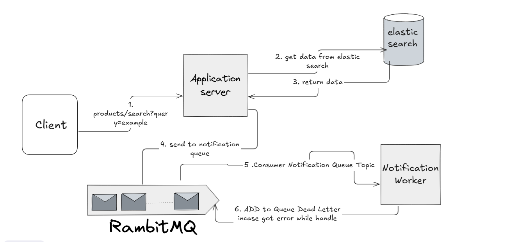
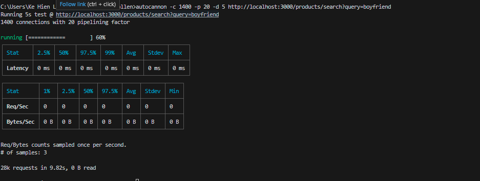

# Product Search System

## Objective
Design a backend architecture for the Product Search functionality of an e-commerce platform, focusing on fast, relevant results and asynchronous insights for the sales team.

## Functional Requirements
1. **Unified Search API**: Single endpoint (`GET /products/search`) accepting a text query parameter.
2. **Multi-Field Search**: Query matches products by Name, SKU, and Description.
3. **Asynchronous Notification**: Every search query is sent as a notification (via RabbitMQ) for sales team analytics.

## Non-Functional Requirements
- **Low Latency**: Fast search results.
- **Resilience**: Notification failures do not impact search.
- **Scalability**: Handles thousands of products and high request volume.

## Tech Stack
- **Express.js**: REST API server
- **Elasticsearch**: Product search engine
- **RabbitMQ**: Asynchronous notification/message queue
- **Docker & Docker Compose**: Containerization and orchestration

---

## System Design



```
┌─────────────────┐    ┌─────────────────┐    ┌─────────────────┐
│   Client/User   │    │   Express API   │    │  Elasticsearch  │
│                 │    │   (Cluster)     │    │                 │
│  Search Query   │───▶│  Search Logic   │───▶│  Product Index  │
│                 │    │                 │    │                 │
└─────────────────┘    └─────────────────┘    └─────────────────┘
                              │
                              ▼
                       ┌─────────────────┐
                       │    RabbitMQ     │
                       │   (Message      │
                       │    Broker)      │
                       └─────────────────┘
                              │
                              ▼
                       ┌─────────────────┐
                       │ Notification    │
                       │   Worker        │
                       │ (Background     │
                       │  Processing)    │
                       └─────────────────┘
```


---

## Why These Technologies?

### Elasticsearch
- **Full-text search**: Superior text search capabilities with relevance scoring
- **Multi-field search**: Search across name, SKU, and description simultaneously
- **Fast queries**: Optimized for read-heavy operations
- **Scalability**: Can handle large product catalogs efficiently

### RabbitMQ + Workers
- **Decoupling**: API response time not affected by notification processing
- **Reliability**: Messages persisted, retry mechanisms for failed processing
- **Scalability**: Multiple workers can process notifications in parallel
- **Monitoring**: Easy to track and debug notification processing

---

## Quick Start

### 1. Clone and Setup
```sh
cd LEKEHIEN_Pollen
# Copy and rename the example environment file
cp example.env .env
```

### 2. Run with Docker Compose
```sh
docker-compose up -d 
# IMPORTANT: Wait at least 4 minutes for Elasticsearch to fully start before initializing data!
```

### 3. Initialize Elasticsearch Data
```sh
node init_elastic_data.js
```

### 4. Test the API
```sh
curl "http://localhost:3000/products/search?query=laptop"
```

### 5. Stress Test the API

You can use [autocannon](https://github.com/mcollina/autocannon) to perform a quick stress test on your search endpoint:

```sh
# Install autocannon globally if you haven't already
npm install -g autocannon

# Run a stress test with 1400 concurrent connections, 20 pipelining, for 5 seconds
autocannon -c 1400 -p 20 -d 5 http://localhost:3000/products/search?query=boyfriend
```


This will simulate heavy load and help you observe the system's performance and stability.
result maximum on my pc without any error 


### 5. Monitor Services
- **API**: http://localhost:3000
- **RabbitMQ Management**: http://localhost:15672 (guest/guest)
- **Elasticsearch**: http://localhost:9200 (elastic/changeme)

---

## API Endpoint

### Search Products
```
GET /products/search?query={search_term}
```


## Project Structure
```
src/
├── connections/           # Database connections
├── controllers/           # Request handlers
├── events/workers/        # Background workers
├── routes/               # Express routes
├── services/             # Business logic
├── types/                # Constants
├── app.js                # Express setup
└── server.js             # Cluster entry point
```

---

